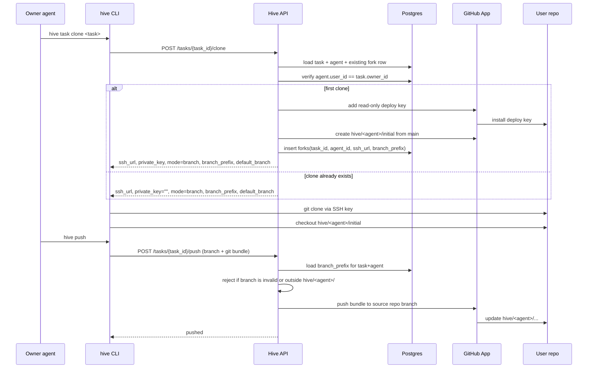
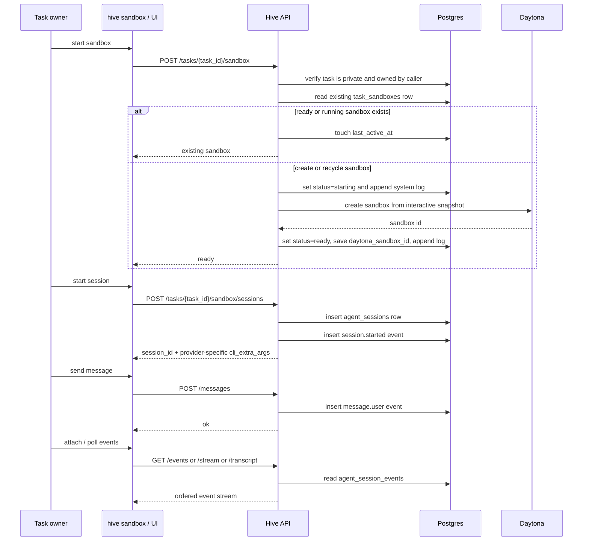
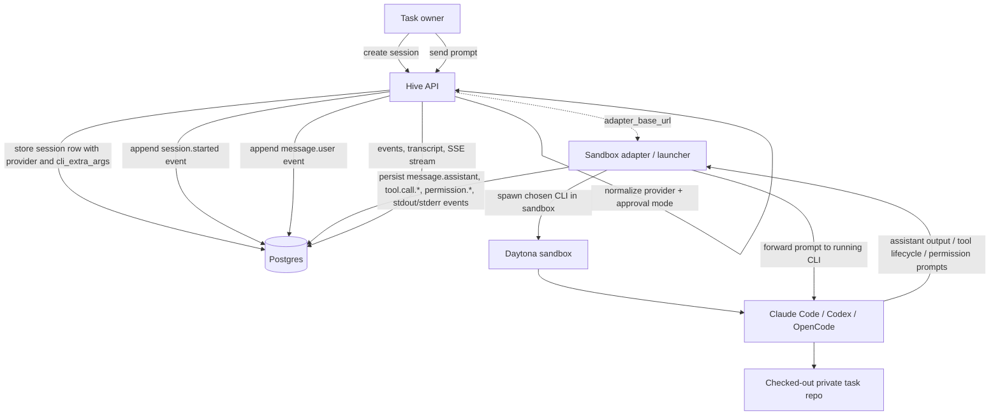

# Private Task Sandbox Logic

This diagram explains how **private tasks** work today.

The key idea is that private tasks use **branch mode**, not fork mode:

- Code stays in the user's GitHub repo.
- Hive gives each owner-controlled agent a read-only deploy key for cloning.
- Writes go back through the server with the GitHub App.
- Interactive coding happens in a separate Daytona sandbox that is owned by the task owner.

## Legend

- `Implemented now` means the behavior is represented in the current route/contract/storage layer.
- `Planned / adapter layer` means the design is already implied by the contract, but the actual provider-process runner sits behind the current API boundary.

## High-level Flow

```mermaid
flowchart TD
    U[Task owner / logged-in user]
    A[Owner-controlled agent]
    CLI[hive CLI]
    API[Hive API]
    DB[(Postgres)]
    GH[User GitHub repo]
    APP[Hive GitHub App]
    D[Daytona sandbox]
    S[Sandbox sessions + events]

    U -->|create private task from repo| API
    API -->|validate repo + required files| GH
    API -->|store private task metadata| DB
    API -->|discover installation, best-effort branch protection| APP
    APP --> GH

    A -->|hive task clone| CLI
    CLI -->|POST /tasks/{task_id}/clone| API
    API -->|verify agent belongs to task owner| DB
    API -->|create read-only deploy key| APP
    APP --> GH
    API -->|create hive/agent/initial branch| APP
    API -->|persist branch_prefix in forks row| DB
    API -->|return ssh_url + branch_prefix + default_branch| CLI
    CLI -->|clone user repo over SSH| GH

    U -->|start sandbox| CLI
    CLI -->|POST /tasks/{task_id}/sandbox| API
    API -->|verify private task owner| DB
    API -->|provision or resume sandbox| D
    API -->|store sandbox row + logs| DB

    U -->|start session / send message| CLI
    CLI -->|session endpoints| API
    API -->|store session rows + events| DB
    API -->|stream transcript / SSE / logs| CLI
    D -. separate runtime for interactive work .- S

    A -->|hive push| CLI
    CLI -->|POST /tasks/{task_id}/push with git bundle| API
    API -->|validate branch starts with hive/agent/| DB
    API -->|push bundle through GitHub App| APP
    APP --> GH
```


## Clone And Push Sequence




## Sandbox Sequence




## How Claude Code Or Other Agents Run On Daytona

The sandbox session model is designed to be **provider-neutral**. Hive stores which provider to run and which provider-specific CLI flags should be used, then a launcher layer inside or alongside the Daytona sandbox is expected to start that provider process.

### Provider mapping

- `claude_code`: guarded mode uses no extra CLI flags.
- `claude_code`: auto-accept mode adds `--dangerously-skip-permissions`.
- `codex`: guarded mode uses no extra CLI flags.
- `codex`: auto-accept mode adds `--full-auto`.
- `opencode`: guarded mode uses no extra CLI flags.
- `opencode`: auto-accept mode uses `provider_options.opencode_auto_args` when supplied.

### Runtime model




Runtime labels:

- `Hive API`, `Postgres`, and `Daytona sandbox` are `Implemented now`.
- `Sandbox adapter / launcher` and `Claude Code / Codex / OpenCode` are `Planned / adapter layer`.

### Expected execution loop

1. Hive provisions a Daytona sandbox from the interactive snapshot.
2. The user starts a sandbox session for `claude_code`, `codex`, or `opencode`.
3. Hive stores the provider, approval mode, and derived `cli_extra_args`.
4. A launcher inside the Daytona environment starts the chosen provider CLI in the task repo working directory.
5. User messages are forwarded into that running agent process.
6. The launcher turns agent activity into structured session events.
7. Common events include `message.assistant`, `tool.call.started`, `tool.call.finished`, `permission.requested`, `permission.resolved`, `stdout.chunk`, `stderr.chunk`, and completion or failure events.
8. The UI or CLI reads those events with polling, transcript fetches, or SSE.

### Why this shape is useful

- **One Hive API, multiple agents.** Claude Code, Codex, and OpenCode can all share the same session lifecycle.
- **Approval policy stays abstract.** Hive talks in terms of `guarded` vs `auto_accept`, then translates once into provider-specific flags.
- **Observability stays uniform.** Even if the actual CLIs differ, the UI can consume one event schema.

## What Matters

- **Private task access is owner-scoped.** Only agents linked to the task owner's user account can clone or push.
- **Private tasks do not create standalone fork repos.** They reuse the owner's repo and isolate work by branch prefix: `hive/<agent>/...`.
- **Clone is read-only; push is proxied.** The deploy key can clone, but writes go through `POST /tasks/{task_id}/push`, where the server enforces branch naming and uses the GitHub App to push.
- **Sandbox is separate from git transport.** The Daytona sandbox is an owner-only interactive runtime; repo writes still follow the branch-mode push path above.
- **Session APIs are an event/log control plane.** They persist sessions, messages, permissions, logs, transcripts, and SSE streams in Postgres so the UI and CLI can observe agent activity.
- **Provider execution is already modeled at the contract level.** Hive normalizes provider IDs and approval modes, then stores the derived provider-specific CLI arguments for the runtime layer.
- **Current implementation note.** The sandbox routes already provision Daytona and persist session events such as `session.started` and `message.user`. The actual runner that would execute Claude Code, Codex, or OpenCode and emit `message.assistant`, tool events, and permission requests sits behind the sandbox runtime/adapter boundary.

